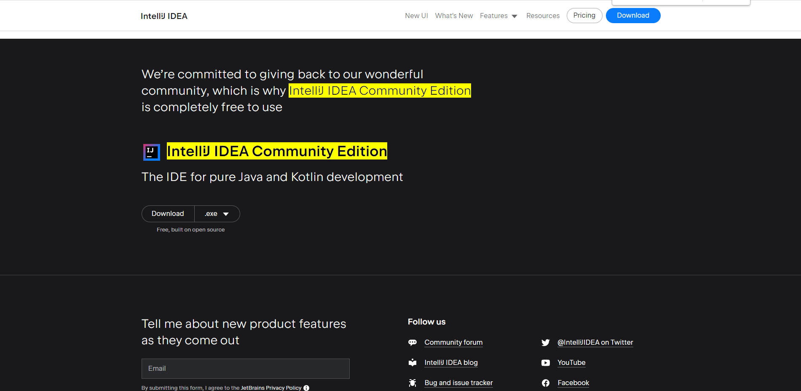

# Introduction to Java

**What is Java?**

Java is a popular programming language, created in 1995.

It is owned by Oracle, and more than 3 billion devices run Java.

It is used for:

1. Mobile applications (specially Android apps)

2. Desktop applications

3. Web applications

4. Web servers and application servers

5. Games

6. Database connection

7. And much, much more!

**Why Use Java?**

1. Java works on different platforms (Windows, Mac, Linux, Raspberry Pi, etc.)

2. It is one of the most popular programming language in the world

3. It has a large demand in the current job market

4. It is easy to learn and simple to use

5. It is open-source and free

6. It is secure, fast and powerful

7. It has a huge community support (tens of millions of developers)

8. Java is an object oriented language which gives a clear structure to programs and allows code to be reused, lowering development costs

9. As Java is close to C++ and C#, it makes it easy for programmers to switch to Java or vice versa

**Prerequisites:**
1. Install Java
   1. Link: https://www.java.com/en/download/help/windows_manual_download.html 
   2. To check if you have Java installed on a Windows PC, type the following in Command Prompt (cmd.exe): C:\Users\Your Name>java -version
2. Install an IDE. I recommend using IntelliJ IDEA Community Edition
   1. Link: https://www.jetbrains.com/idea/download/?section=windows)
   
